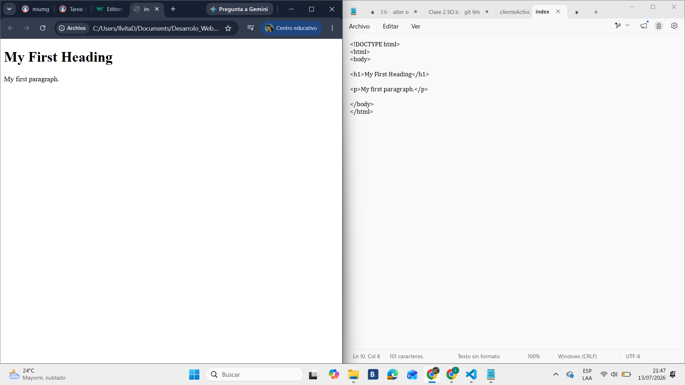
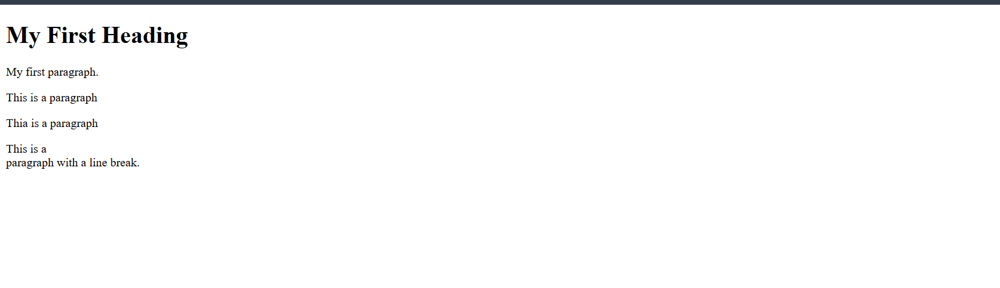
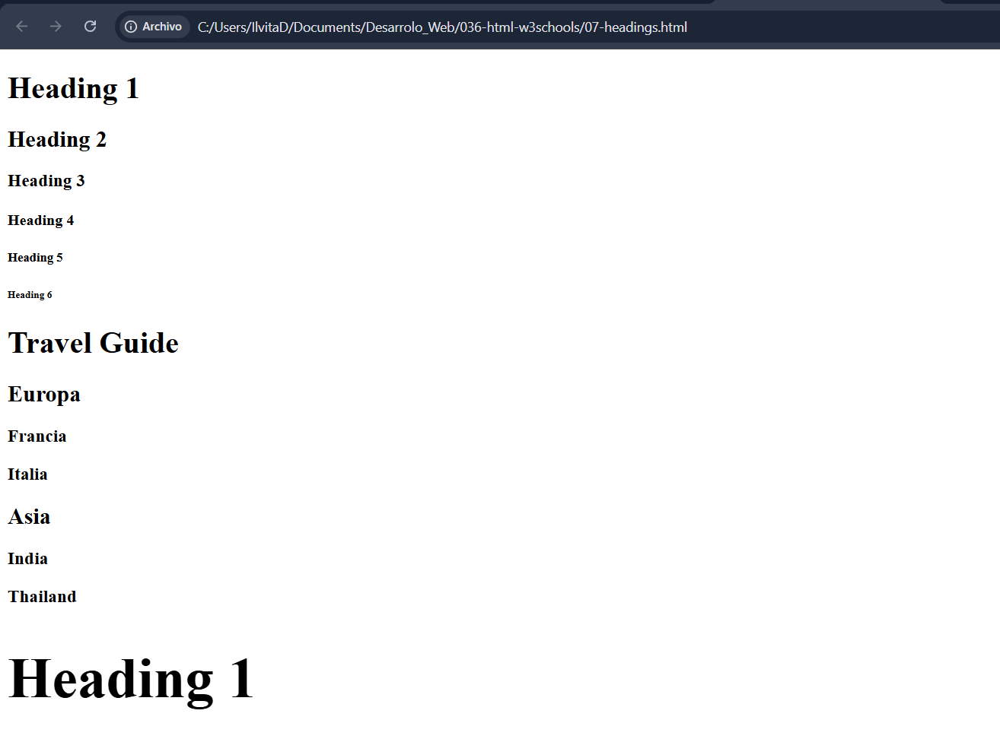
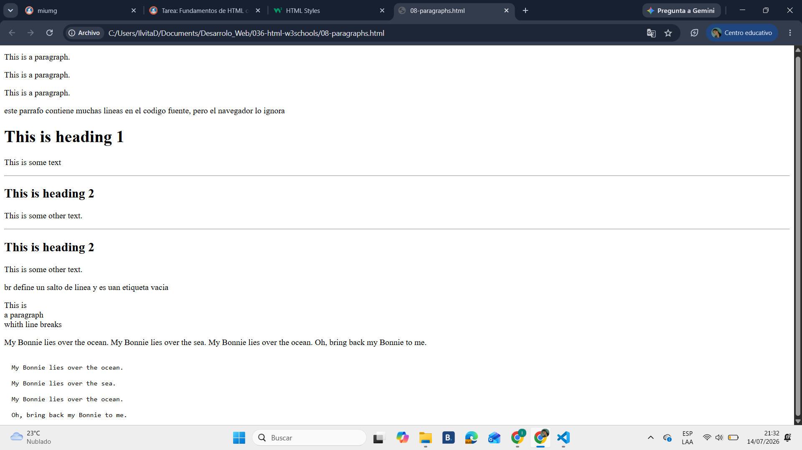
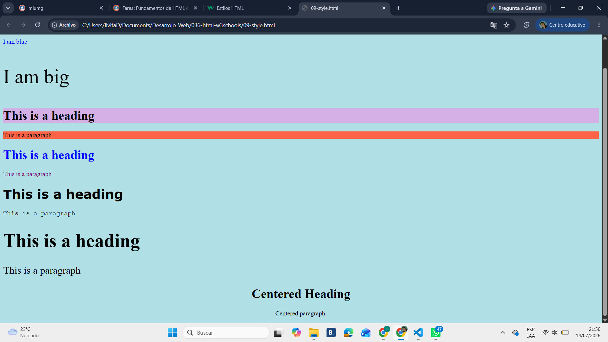

# 036-html-w3schools
Fundamentos de HTML con W3Schools

## HTML es el lenguaje de marcado estándar para páginas web.

01-home

02-introduccion
## ¿Qué es HTML?
HTML significa Lenguaje de Marcado de Hipertexto, es el lenguaje de marcado estándar para crear páginas web.
describe la estructura de una página web, consta de una serie de elementos
Los elementos HTML le indican al navegador cómo mostrar el contenido.
Los elementos HTML etiquetan fragmentos de contenido como "este es un encabezado", "este es un párrafo", "este es un enlace", etc.

03-editor

04-basico
# Encabezados
se define con las etiquetas h1 a h6
h1 define el encabezado mas importante y el h6 define el encabezado menos importante

# parrafos
los parrafoes de definen con la etiqueta p

# enlaces
los enlaces se definen con la "a"

# imagenes
se definen con img
El archivo fuente ( src), el texto alternativo ( alt), widthy heightse proporcionan como atributos

# elementos
Un elemento HTML se define mediante una etiqueta de inicio, algún contenido y una etiqueta de cierre.

# atributos
- Todos los elementos HTML pueden tener atributos.
- Los atributos proporcionan información adicional sobre los elementos.
- Los atributos siempre se especifican en la etiqueta de inicio.
- Los atributos suelen presentarse en pares nombre/valor como: nombre="valor"

La a etiqueta define un hipervínculo. El hrefatributo especifica la URL de la página a la que conduce el enlace

* El atributo lang
Siempre debes incluir el langatributo dentro de la  html etiqueta para declarar el idioma de la página web. 

* El atributo del título
Este titleatributo define información adicional sobre un elemento.

07-headings

08-parrafos
Reglas horizontales HTML
Esta hr etiqueta define una separación temática en una página HTML y, por lo general, se muestra como una línea horizontal.

09-estilos
El style atributo HTML se utiliza para añadir estilos a un elemento, como color, fuente, tamaño, etc.

- Utilice el styleatributo para dar estilo a los elementos HTML.
- Utilizar background-colorpara el color de fondo
- Utilizar colorpara colores de texto
- Utilizar font-familypara fuentes de texto
- Utilizar font-sizepara tamaños de texto
- Utilizar text-alignpara la alineación del texto

10-formato
b- Texto en negrita
strong- Texto importante
i- Texto en cursiva
em- Texto resaltado
mark- Texto marcado
small- Texto más pequeño
del- Texto eliminado
ins- Texto insertado
sub- Texto de subíndice
sup- Texto en superíndice
